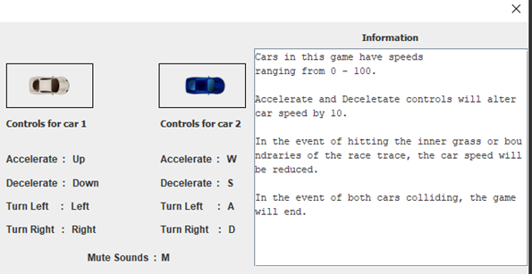
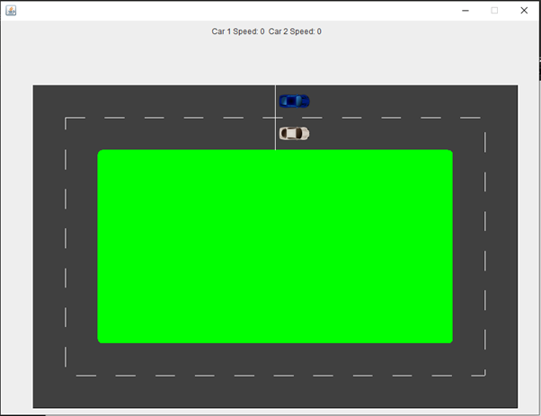

# Distributed-Programming assignment 

This is an assignment for a university module called "Distributed Programming". It is a module that covers distributed programming concepts and the projects present in this respository show that the learning outcomes of the module have been met.

Part 1 is a sprite animation of a car spinning. This animation is done using a timer and several images of the car. It is quite straightforward but this rotation is very important for Part 2 and 3.

Part 2 is a racing Game where two cars are controlled by two local players using the same keyboard to control a blue and white car respectively.

Part 3 is a contunation of part 2, the difference being that this version of the game allows both players to play over a network (The internet or whatever network they wish to use)

